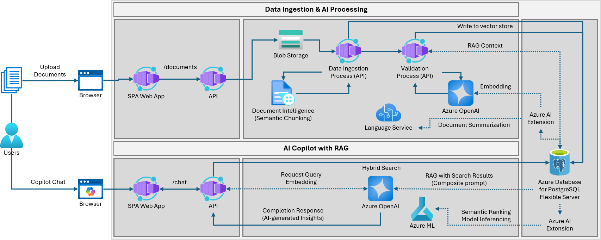

# 3. The App Architecture

The objective of this solution is to automate the extraction, validation, and storage of invoices and SOWs to minimize manual effort and boost operational efficiency. This solution architecture facilitates seamless integration across multiple Azure services, ensuring scalability, security, and optimized costs, while accurately aligning invoices with milestone-based deliverables and other contractual obligations.

The high-level solution architecture is represented by this diagram:

Click on each tab to understand the archtiecture components and processing workflow.

---

=== "1. Architecture Components"

    The architecture has these core components:
    
    - _UI_ → the **user interface** for interacting with the system
    - _API_ → a Python API for integrating backend services
    - _Azure Database for PostgreSQL_ → the project **database** (vendors, invoices, statements of work (SOWs))
    - _Azure OpenAI_ → the **model deployments** (embedding, chat, eval)
    - _Azure Container Apps_ → the **app hosting** service (API endpoint)
    - _Azure Managed Identity_ → for **keyless authentication** (trustworthy AI)

=== "2. Processing Services"

    The Architecture "processes" incoming user requests received on the hosted API endpoint by taking the following steps:

    1. **Data Ingestion**: SOWs, invoices and other related documents are ingested via a custom REACT web application. Internal users and external vendors can submit documents by uploading them through the web app, which then uploads them to Azure Blob Storage.

    2. **Workflow Trigger Mechanism**: Upon receipt of new documents, an event trigger activates Python-based background worker processes:

        a. **Data Extraction and Processing**: Azure's OCR (Optical Character Recognition) technology digitizes content from uploaded documents, such as SOWs and invoices.
    
        b. **Document Intelligence (Custom Model)**: A custom AI model within Azure's Document Intelligence service is tailored to extract specific data fields, like payment milestones, dates, amounts, and vendor details. This model is trained to recognize the structure of financial documents, improving data extraction accuracy.

        c. **Confidence Scoring and Validation**: Each document is assigned a confidence score based on whether the documents contain the correct sections and fields.

        d. **Validation Using Azure OpenAI**: Azure OpenAI language models, such as GPT-4o, are used to review all document data, employing natural language understanding to validate and cross-check information, ensuring high data integrity. The language model is used to cross-reference data between invoices and SOWs, evaluating payment milestone completion and billing, and preventing issues like payment delays. It also validates that appropriate compliance language exists in contracts and SOWs, helping to avoid compliance violations.

    3. **Secure Storage and Database Management**: Validated data is chunked, vectorized using an Azure OpenAI embedding model, and stored in an encrypted Azure Database for PostgreSQL flexible server database, which uses vector embeddings for advanced search and retrieval. This supports efficient handling of structured and semi-structured data, facilitating downstream analytics. Azure Database for PostgreSQL flexible server supports JSON-based semi-structured data and vector embedding storage, enabling AI-enhanced queries. Embeddings can be generated directly from database queries using the Azure AI extension for PostgreSQL.

    4. **Document enrichment**: The Azure AI extension for PostreSQL also enables data to be enhanced using Azure AI Services directly from the database. This capability provides rich AI functionality, such as text translation and entity and keyword extraction.

    5. **Copilot chat**: An Azure OpenAI + LangChain copilot enables project managers and leadership to quickly get metrics, trends and processing timelines for contracts, SOWs, invoices, and vendors using a user friendly chat interface. Function calling via LangChain tools enables the copilot to implement a RAG (retrieval-augmented generation) pattern over data in the PostgreSQL database, using vector search to efficiently retrieve relevant documents and data.
