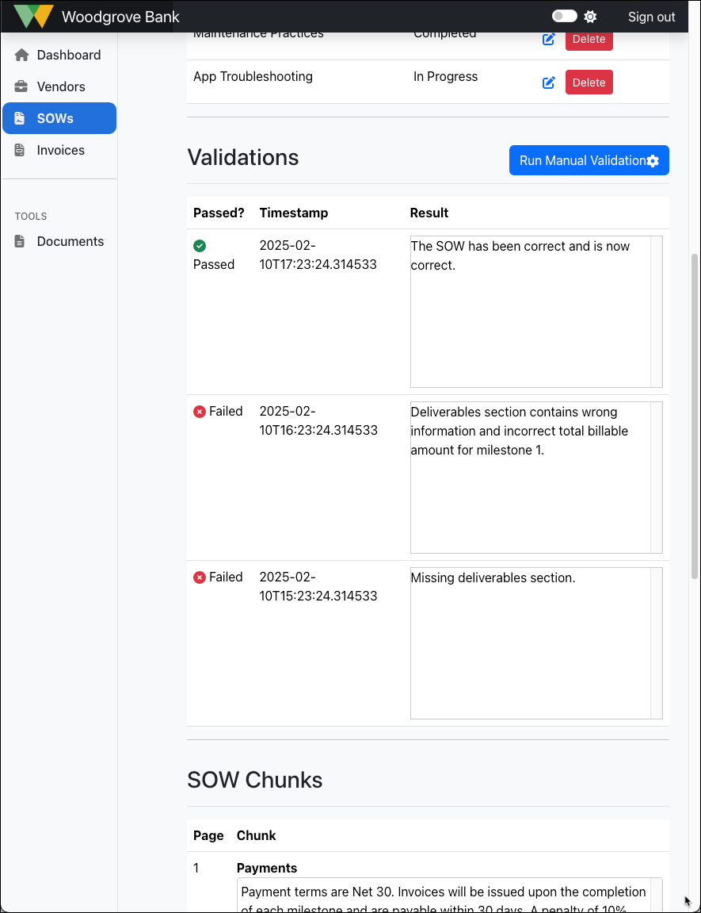
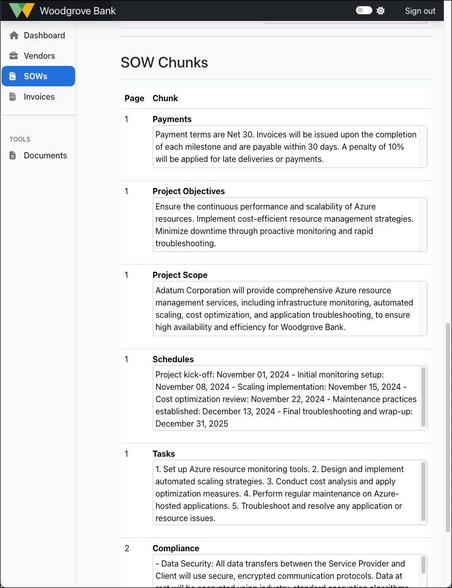
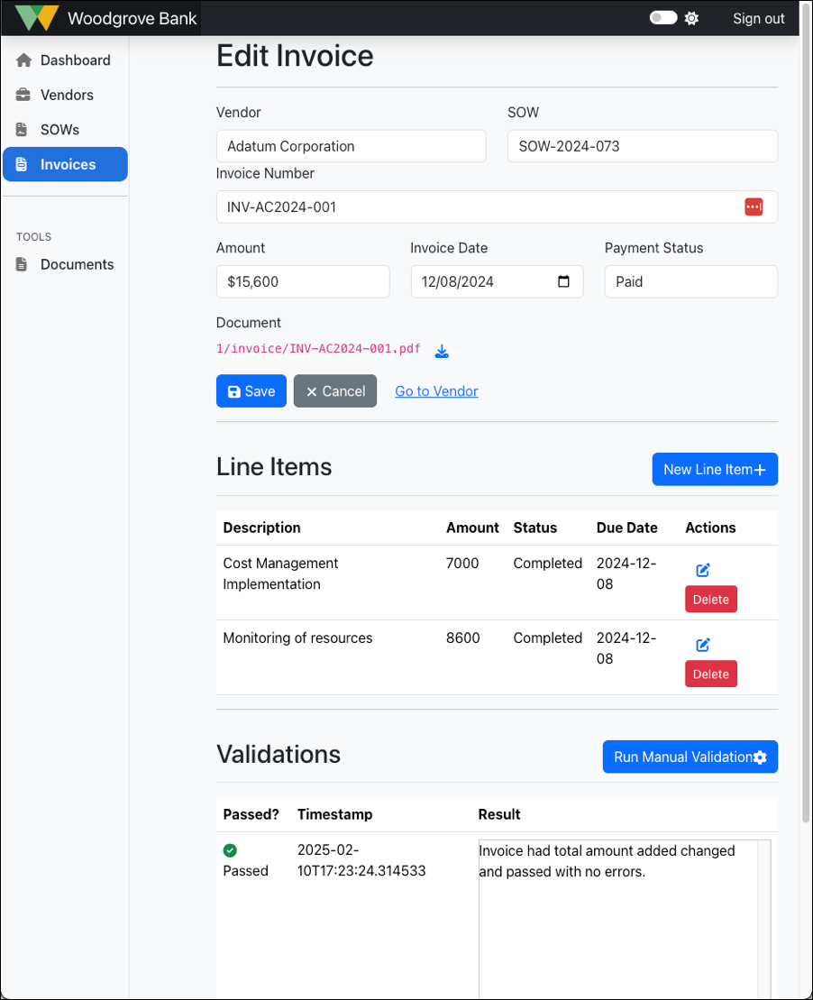
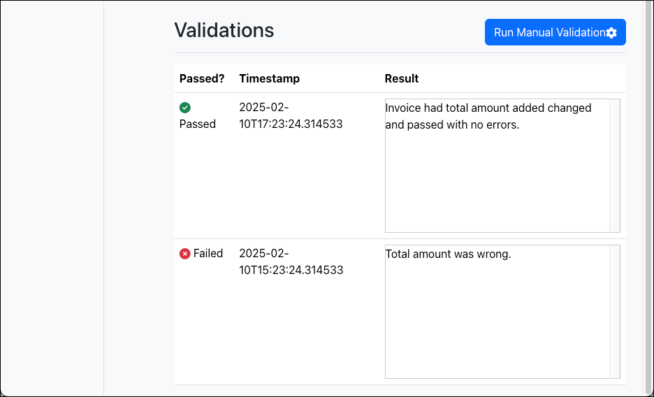

# 2.7 Review Manual Process

Before beginning the process if integrating AI capabilities into the _Woodgrove Bank Contract Management_ application, let's review the manually process they are currently using to enter data into the system. Keep in mind that a user would need to first read the SOW and Invoice document, before copying and pasting the correct information into the application fields. This manual process can be very time consuming and error-prone.

## Review SOWs

Let's review the application UI for SOWs.

1. In the Woodgrove Bank Contract Management Portal, select the **SOWs** page and to view the list of SOWs.

    

2. Locate the **SOW-2024-073** SOW, then select the **Edit** button under the **Actions** column. This will open the edit page for the SOW.

    

3. On the SOW Edit page, notice the primary fields that need to be entered for the **Statement of Work** (Vendor, SOW Name, Budget, State Date, and End Date). Also, notice the list of Milestones that must be manually entered for the SOW based on the SOW document that was uploaded.

    

4. Select the **Edit** button for the **Monitoring** milestone. This will open the **Edit Milestone** page, where you can see the required fields for the Milestone as well as the Deliverables that must be manually entered based on the SOW document that was uploaded. After reviewing the fields and deliverables, select the **Back to SOW** button.

    

5. On the **Edit SOW** page, notice the **Validations** history list. These validations have each been manually entered over time as the SOW has been updated.

    

6. Below the **Validations** you will see the list of **SOW Chunks**. These are the titles and content from the various different sections of the SOW document. In the manual workflow, these were manually copy and pasted into the application to extract text from the SOW document. This is entered by a user as they read through and review the SOW document.

    

## Review Invoices

Let's review the application UI for Invoices.

1. In the Woodgrove Bank Contract Management Portal, select the **Invoices** page and to view the list of Invoices. Then select the **Edit** button for the first Invoice in the list. This will bring up the Invoice Edit page.

    

2. On the **Edit Invoice** page, review all the different sections of data that must be manually entered for the uploaded invoice document:

    - **Invoice** fields (Vendor, SOW Name, Invoice Number, Amount, Invoice Date, Payment Status)
    - **Line Items** must be extracted from the Invoice document and manually entered.
    - **Validations** are manually entered by the user as they manually review the uploaded invoice document.

    

3. Within the **Validations**, notice the **Result** entered manually is generally very short and does not contain very much information.

    

    Something you will notice as you integrate AI into the application, in later sections, is that Validation summaries generated by AI will be much more informative.

!!! success "Congratulations! You have reviewed the SOW and Invoice data fields that are entered manually for the old workflow. In the next units, you will work to integrate an AI-powered workflow!"
