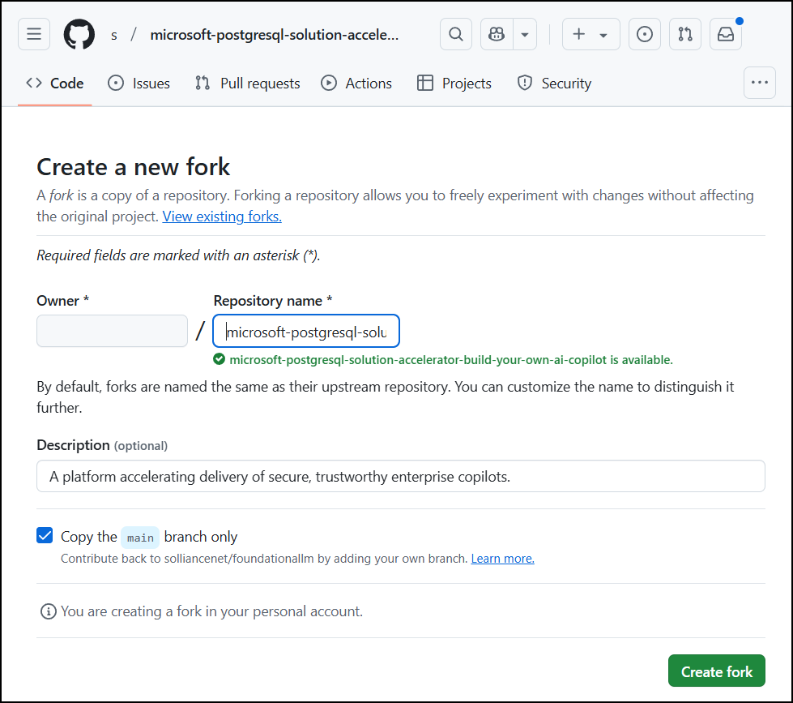
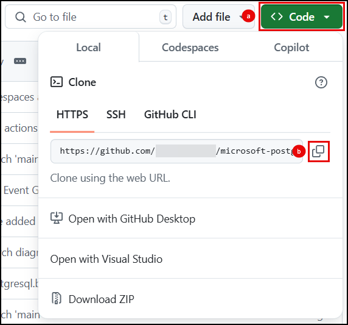
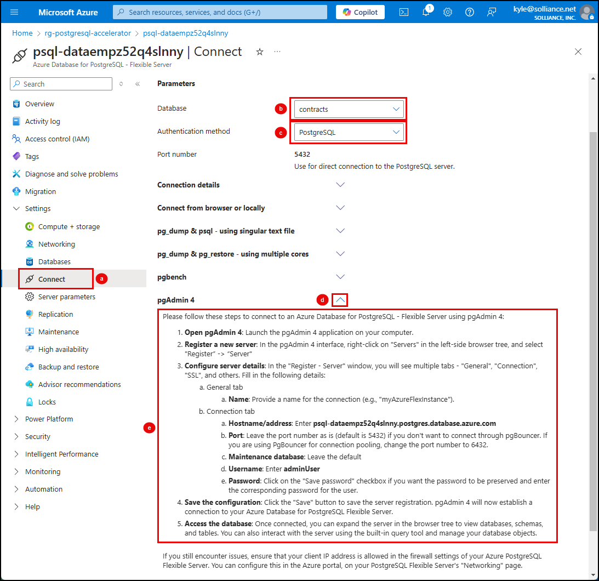

# A. Self-Guided Setup

Welcome to the Self-Guided Lab Track! You will need a valid Azure subscription, a GitHub account, and access to relevant Azure OpenAI models to complete this lab. Review the [prerequisites](/microsoft-postgresql-solution-accelerator-build-your-own-ai-copilot/02-Setup/0-Prerequisites#self-guided) section if you need more details.

!!! question "WERE YOU LOOKING FOR THE INSTRUCTOR-LED OPTION INSTEAD? [You can find that here.](./02-Instructor-Led.md)"

---

You will need to install the required software locally and provision the Azure infrastructure yourself, as described on the tabs below.

!!! task "Select each of the tabs below, in order, to complete the required setup."

=== "1. Install software"

    The required development environment uses a Visual Studio (VS) Code editor with a Python runtime. To complete this lab on your own computer, you must install the following required software. On completing this step, you should have installed:

    - [X] Azure command-line tools
    - [X] Git
    - [X] Python 3.11+
    - [X] Visual Studio Code and required extensions
    - [X] pgAdmin
    
    ## **1.1 Install Azure command-line tools**

    !!! task "In this task, you will install the Azure CLI and the Azure Developer CLI (`azd`)."

        - The Azure CLI enables you to execute Azure CLI commands from a command prompt or VS Code terminal on your local machine.
        - The Azure Developer CLI (`azd`) is an open-source tool that accelerates provisioning and deploying app resources on Azure.
    
    1. Download and install the latest version of the [Azure CLI](https://docs.microsoft.com/cli/azure/?view=azure-cli-latest).

    2. Once installed, open a command prompt on your machine and verify the installation by running the following:

        ```azurecli title=""
        az version
        ```

    3. Next, install the `ml` extension to the Azure CLI.
 
        !!! info "The ml extension to the Azure CLI is the enhanced interface for Azure Machine Learning. It enables you to train and deploy models from the command line, with features that accelerate scaling data science up and out while tracking the model lifecycle.""

        To install the `ml` extensinon you should first remove any existing installation of the extension and also the CLI v1 `azure-cli-ml` extension:
    
        ```azurecli title=""
        az extension remove -n azure-cli-ml
        az extension remove -n ml
        ```

        Then, run the following to install the latest version of the `ml` extension:
    
        ```azurecli title=""
        az extension add -n ml
        ```

    4. Install Azure Developer CLI by following the instructions for your OS at <https://learn.microsoft.com/en-us/azure/developer/azure-developer-cli/install-azd>.

    5. Execute the following command from a terminal prompt to verify the tools were installed:
        
        ```bash title=""
        azd version
        ```

    ## **1.2 Install Python**

    1. Download Python 3.11+ from <https://python.org/downloads>.

    2. Run the installer using the default options.

    3. Use the following command from a terminal prompt to verify Python was installed:

        ```bash title=""
        python --version
        ```

    ## **1.3 Install Git**

    5. Download Git from <https://git-scm.com/downloads>.

    6. Run the installer using the default options.

    ## **1.4 Install Visual Studio Code (and extensions)**

    Visual Studio Code is a versatile, open-source code editor that combines powerful features with an intuitive interface to help developers efficiently write, debug, and customize their projects.
    
    The Prompty extension enhances productivity by providing intelligent code completions and suggestions, while the Python extension offers a comprehensive environment for Python development, including robust debugging, linting, and testing capabilities.

    7. Download and install from <https://code.visualstudio.com/download>.

        - Use the default options in the installer.

    8. After installation completed, launch Visual Studio Code.

    9. In the **Extensions** menu, search for and install the following extensions from Microsoft:

        - [Python](https://marketplace.visualstudio.com/items?itemName=ms-python.python)
        - [Prompty](marketplace.visualstudio.com/items?itemName=ms-toolsai.prompty)

            !!! info "[Prompty](https://prompty.ai) is an open-source generative AI templating framework that makes it easy to experiment with prompts, context, parameters, and other ways to change the behavior of language models. The easiest way to get started with **Prompty**, is to use the Visual Studio Code Extension. The offers an intuitive prompt playground within VS Code to streamline the prompt engineering process."

    10. Close VS Code.

    ## **1.5 Install pgAdmin**

    Throughout this workshop, you will use pgAdmin to run queries against your PostgreSQL database. pgAdmin is the leading Open Source management tool for Postgres.

    1. Download pgAdmin from <https://www.pgadmin.org/download/>.

    2. Run the installer using the default options.

=== "2. Fork repo"

    You must create a copy (known as a fork) of the GitHub repo and then clone that onto your local computer so you can work with the contents of the repo.

    At the end of this step, you should have:
    
    - [X] Forked the **PostgreSQL Solution Accelerator: Build your own AI Copilot** repo to your personal GitHub profile
    - [X] Created a local clone of the repo
    - [X] Opened the cloned repo in Visual Studio Code


    ## 2.1 Fork Repo To Your Profile

    Forking in GitHub refers to creating a personal copy of a public repository, which allows you to freely experiment with changes without affecting the original project.

    1. To fork the **PostgreSQL Solution Accelerator: Build your own AI Copilot** repo, open a new browser window or tab and navigate to the repo at <https://github.com/solliancenet/microsoft-postgresql-solution-accelerator-build-your-own-ai-copilot>.

    2. Select the **Fork** button to create a copy of the repo in your GitHub profile.

        

    3. Login with your GitHub profile, if prompted.

    3. On the **Create a new fork** page, select **Create fork** to make a copy of the repo under your GitHub profile.

        

    4. The forked repo will open within your profile. On the GitHub page for your fork that opens, select the **Code** button and select the **Copy URL to clipboard** button next to the repo's HTTPS clone link:

        

    5. Open a new command prompt and change directories to the folder within which you want to clone the repo (e.g., D:\repos).

    6. Once in the desired directory, run the following `git clone` command to download a copy of your fork onto your local machine. Ensure you replace the `[url_of_your_forked_repo]` token with the clone link you copied in the previous step.

        ```bash title=""
        git clone [url_of_your_forked_repo]
        ```

    7. Once the repository has been cloned, change directories at the command prompt to the folder of the cloned repo, then run the following command to open the project in Visual Studio Code:

        ```bash title=""
        code .
        ```

    !!! tip "Leave Visual Studio Code open as you will be using it throughout the remainder of the workshop."

=== "3. Provision Azure infrastructure"

    _This project uses an `azd-template`, which defines infrastructure-as-code assets that are used by the Azure Developer CLI to provision and manage your solution infrastructure resources_. On completing this step, you should have:

    - [X] Authenticated with Azure
    - [X] Provisioned Azure resources
    - [X] Deployed the starter solution

    This solution contains an Azure Developer CLI template that provisions various required resources in Azure and deploys the starter app to Azure Container Apps (ACA).

    You are now ready to connect your VS Code environment to Azure.

    ## 3.1 Authenticate With Azure
    
    1. To create Azure resources, you need to be authenticated from VS Code. Open a new intergated terminal in VS Code. Then, complete the following steps:
    
    !!! task "Step 1: Authenticate with `az` for post-provisioning tasks"
    
    1. Log into the Azure CLI `az` using the command below.
    
        ```bash  title=""
        az login
        ```

    2. Complete the login process in the browser window that opens.

        !!! info "If you have more than one Azure subscription, you may need to run `az account set -s <subscription-id> to specify the correct subscription to use."

    !!! task "Step 2: Authenticate with `azd` for provisioning & managing resources"
    
    3. Log in to Azure Developer CLI. This is only required once per-install.
    
        ```bash title=""
        azd auth login
        ```
    
    ## 3.2 Provision & Deploy App

    Provision & deploy the solution with one command: ```azd up```

    1. Use `azd up` to provision your Azure infrastructure and deploy the web application to Azure.
    
        ```bash title=""
        azd up
        ```

        !!! task "You will be prompted for various inputs for the `azd up` command"
    
              - Subscription - specify your own active Azure subscription ID
              - Environment name for resource group
              - Location for deployment
                - Refer to [Region Availability](#region-availability) guidance and pick the option with desired models and quota available.
    
    2. Wait for the process to complete. It may take 5-10 minutes or more.
 
    3. On successful completion you will see a `SUCCESS: ...` message on the console.

    !!! tip "After running `azd up` on the **ACA** deployment and the deployment finishes, you can locate the URL of the web application by navigating to the deployed resource group in the Azure portal. Click on the link to the new resource group in the output of the script to open the Azure portal."

=== "4. Setup dev environment"

    In this step, you will configure your Python development environment in Visual Studio Code. At the end of this step, you should have:

    - [X] Created a Python virtual environment
    - [X] Installed the required Python libraries from `requirements.txt`
    - [X] Connected to your database using pgAdmin

    ## **4.1 Create a Python virtual environment**

    Virtual environments in Python are essential for maintaining a clean and organized development space, allowing individual projects to have their own set of dependencies, isolated from others. This prevents conflicts between different projects and ensures consistency in your development workflow. By using virtual environments, you can manage package versions easily, avoid dependency clashes, and keep your projects running smoothly. It's a best practice that keeps your coding environment stable and dependable, making your development process more efficient and less prone to issues.
    
    1. Return to Visual Studio Code, where you have the **PostgreSQL Solution Accelerator: Build your own AI Copilot** project open.
    
    2. In Visual Studio Code, open a new terminal window and change directories to the `src/api` folder of the repo.
    
    3. Create a virtual environment named `.venv` by running the following command at the terminal prompt:
    
        ```bash
        python -m venv .venv 
        ```
    
        The above command will create a `.venv` folder under the `api` folder, which will provide a dedicated Python environment for the `api` project that can be used throughout this lab.
    
    4. Activate the virtual environment.

        !!! task "Select the appropriate command for your OS and shell from the table below and execute it at the terminal prompt."
    
            | Platform | Shell | Command to activate virtual environment |
            | -------- | ----- | --------------------------------------- |
            | POSIX | bash/zsh | `source .venv/bin/activate` |
            | | fish | `source .venv/bin/activate.fish` |
            | | csh/tcsh | `source .venv/bin/activate.csh` |
            | | pwsh | `.venv/bin/Activate.ps1` |
            | Windows | cmd.exe | `.venv\Scripts\activate.bat` |
            | | PowerShell | `.venv\Scripts\Activate.ps1` |
    
    ## **4.2 Install required Python libraries**
    
    The `requirements.txt` file in the `src\api` folder contains the set of Python libraries needed to run the Python components of the solution accelerator.

    !!! tip "Open the `src\api\requirements.txt` file in the repo to review the required libraries and the versions that are being used."

    1. From the integrated terminal window in VS Code, run the following command to install the required libraries in your virtual environment:

        ```bash title=""
        pip install -r requirements.txt
        ```

    ## **4.3 Connect to your database from pgAdmin**

    You will use pgAdmin from your machine to configure various features in the database and execute queries to test those features. Please follow the steps below to connect to your Azure Database for PostgreSQL - Flexible Server using pgAdmin:

    8. Navigate to your Azure Database for PostgreSQL - Flexible Server resource in the [Azure portal](https://portal.azure.com/).
    9. On the Azure Database for PostgreSQL - Flexible Server page:
       1. Select **Connect** under **Settings** in the left-hand resource menu.
       2. Select the **TODO** database from the **Database name** dropdown.
       3. Expand the **pgAdmin 4** block.
       4. Follow the steps provided to connect to your database from pgAdmin.

        TODO: Update screenshot with correct database name

        

    !!! tip "Leave pgAdmin open as you will be using it throughout the remainder of the workshop."
---

## Next → [Validate Setup](./03-Validation.md)
