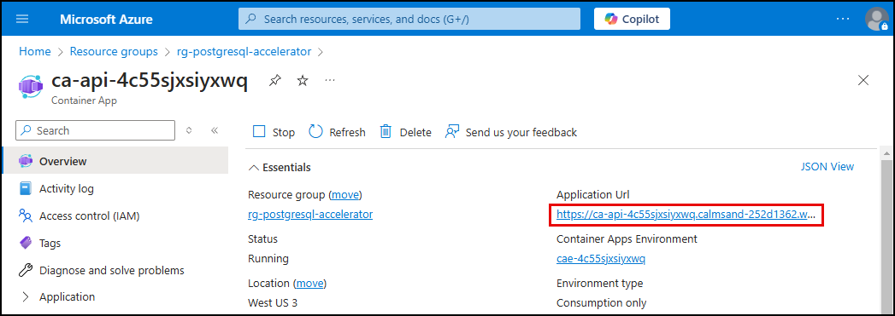
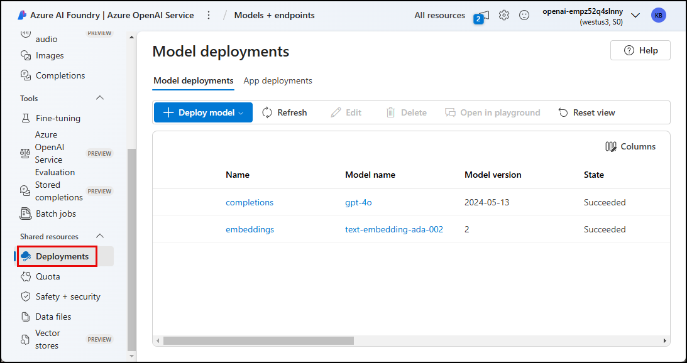
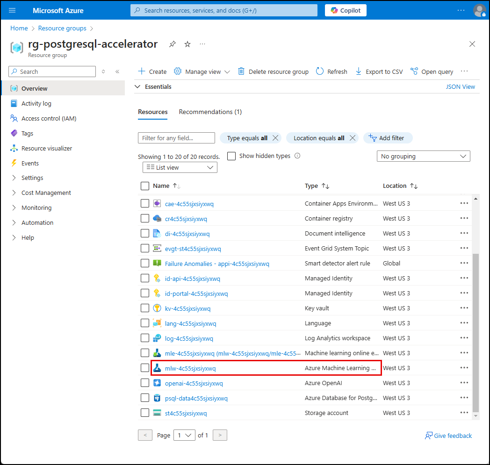
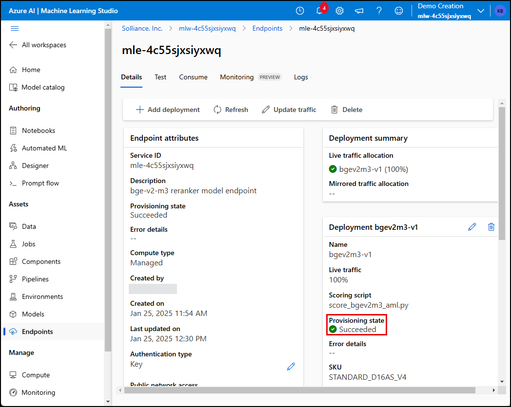

# Validate Your Setup

!!! success "SETUP IS COMPLETE!"

    You just completed the **PROVISION** and **SETUP** steps of workshop. 

    - [X] You installed the required tools and software
    - [X] You forked the sample repo and created a local clone
    - [X] You provisioned infrastructure resources on Azure
    - [X] You deployed the REACT UI and Python API to Azure Container Apps
    - [X] You configured your local development environment

Here's a reminder of the Azure Application Architecture you can reference as you check your provisioned Resource Group to enure these resources were created.


In this section, you will validate your setup before moving on to the next phase of solution development.

---

## 1. Inspect deployed Azure resources

!!! tip "The Azure Portal allows you to view the resources provisioned on Azure and verify that they are setup correctly"

1. Open a new browser tab and navigate to the link below. You may be prompted to login.

    ```bash title=""
    https://portal.azure.com/#browse/resourcegroups
    ```

2. You may be presented with a "Welcome to Microsoft Azure" screen. Select **Cancel** (to dismiss it) or click **Get Started** (to take an introductory tour of the Azure Portal).

3. You should be taken directly to the Resource Groups page for your subscription. In the list of resource groups, locate the one named `rg-postgresql-accelerator` (or, if you assigned a different name, find that one). This resource group was created for you as part of the `azd up` resource deployment. It contains all of the Azure resources required to build and deploy your AI-enable solution.

    !!! tip "You can use the search filter to reduce the number resource groups displayed."

4. Select your resource group.

    !!! note "Review the list of deployed resources."

        In addition to creating a resource group, the `azd up` command deployed multiple resources into that resource group, as shown in the table below.

        | Resource type | Name |
        | :-- | :-- |
        | Container Registry | `cr<unique_string>` |
        | Log Analytics workspace | `log-<unique_string>` |
        | Key Vault | `kv-<unique_string>` |
        | Document Intelligence | `di-<unique_string>` |
        | Language | `lang-<unique_string>` |
        | Application Insights | `appi-<unique_string>` |
        | Container Apps Environment | `cae-<unique_string>` |
        | Storage account | `st<unique_string>` |
        | Azure Database for PostgreSQL - Flexible Server | `psql-data<unique_string>` |
        | Azure OpenAI | `openai-<unique_string>` |
        | Machine Learning Workspace | `mlw-<unique_string>` |
        | Machine Learning Endpoint | `mle-<unique_string>` |
        | Container App | `ca-api-<unique_string>` |
        | Container App | `ca-portal-<unique_string>` |

        The `<unique_string>` token in the above resource names represents the unique string that is generated by the Bicep scripts when naming your resources. This ensures resources are uniquely named and avoid resource naming collisions.

        In addition to the above resources, you will also see several other resources, like _Managed Identities_, that are supporting resources for those in the table.

## 2. Ensure the deployed apps are running

The `azd up` command included steps to deploy the Woodgrove Bank application into **Azure Container Apps** (ACA). Two containers were created. One for the Woodgrove Bank portal UI and a second for the backend API that supports it.

!!! info "Azure Container Apps (ACA) deployment"

    ACA is a fully managed serverless platform that allows you to deploy and manage containerized applications effortlessly. They simplify deployment, offer scalability and cost-effectiveness, and make it easier to focus on building applications without worrying about infrastructure management.

### 2.1 Confirm the Woodgrove API Is Running

1. In the browser window opened to your Azure resource group, select the **Container app** resource whose name starts with **ca-api**.

    

2. In the **Essentials** section of the API Container App's **Overview** page, select the **Application Url** to open the deployed Woodgrove Bank API in a new browser tab.

    

3. You should see a `Welcome to the Woodgrove Bank API!` message on the screen, which serves as confirmation the API app was deployed successfully.

### 2.2 Open the Woodgrove Portal UI

1. In the Azure portal, return to the resource group containing your resources and select the **Container app** resource whose name begins with **ca-portal**.

    

2. In the **Essentials** section of the Portal Container App's **Overview** page, select the **Application Url** to open the deployed Woodgrove Bank Portal in a new browser tab.

    

3. In the Woodgrove Bank Contract Management Portal, select the **Vendors** page and verify the list of vendors loads correctly.

    

## 3. View Azure OpenAI model deployments in Azure AI Foundry

!!! tip "The Azure AI Foundry portal lets you view and manage the Azure AI resources for your app."

You will use the Azure AI Foundry portal to verify the `gpt-4o` and `text-embedding-ada-002` models were deployed into your Azure OpenAI service.

1. In the Azure portal, return to the resource group containing your resources and select the **Azure OpenAI** resource.

    

2. On the Azure OpenAI resource's **Overview** page, select **Explore Azure AI Foundry portal**.

    

3. In **Azure AI Foundry**, select the **Deployments** menu item under **Shared resources** in the left-hand navigation menu.

    

4. Verify you see a `completions` deployment for the `gpt-4o` model and an `embeddings` deployment for the `text-embedding-ada-002` model.

## 4. Verify Semantic Ranker Model Deployment (optional)

If you chose to deploy the Azure ML semantic ranker model during setup, you will use the Azure Machine Learning Studio to ensure the semantic ranker model was successfully deployed to an online endpoint.

!!! note "You only need to do this step if you chose TRUE for `deployAMLModel` during the `azd up` deployment."

1. In the Azure portal, return to the resource group containing your resources and select the **Azure Machine Learning Workspace** resoure.

    

2. From the Azure ML workspace page, select the **Launch studio** button to open Azure Machine Learning Studio in a new browser window.

    

3. Sign into Machine Learning Studio if prompted.

4. In Machine Learning Studio, select **Endpoints** under **Assets** in the left-hand resource menu, then select the endpoint for your `bge-v2-m3-reranker model`:

    

5. On your endpoint page, ensure the **Provisioning state** for the _bgev2m3-v1_ deployment is **Succeeded**.

    

!!! tip "Leave the Azure Portal open. You will revisit it later."
