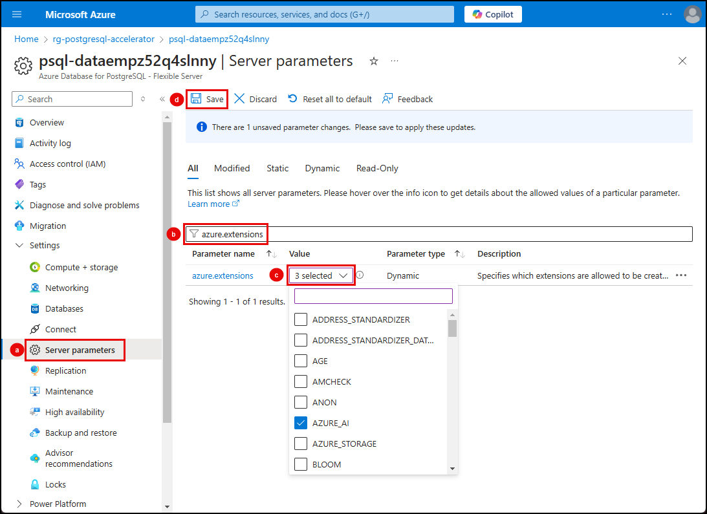

# 3.1 Install extensions

Azure Database for PostgreSQL flexible server allows you to extend the functionality of your database using extensions. Extensions bundle multiple related SQL objects into a single package that can be loaded or removed from your database with a single command. After being loaded into the database, extensions function like built-in features.

## Allowlist the extensions

Before installing and using extensions in Azure Database for PostgreSQL flexible server, you must add them to the server's _allowlist_, as described in [how to use PostgreSQL extensions](https://learn.microsoft.com/azure/postgresql/extensions/how-to-allow-extensions).

!!! note "Select the tab of the method you want to use for allowlisting the extensions and follow the instructions provided."

=== "Azure CLI"

    1. Open a new integrated terminal window in VS Code and execute the following Azure CLI command at the prompt.

    !!! note "Ensure you replace the tokens in the command below with the appropriate values from your Azure environment."

        - **[YOUR_RESOURCE_GROUP]**: The name of the resource group hosting your Azure Database for PostgreSQL flexible server.
        - **[YOUR_POSTGRESQL_SERVER]**: The name of your Azure Database for PostgreSQL server.
        - **[YOUR_SUBSCRIPTION_ID]**: Your Azure subscription ID.
    
    ```bash
    az postgres flexible-server parameter set --resource-group [YOUR_RESOURCE_GROUP]  --server-name [YOUR_POSTGRESQL_SERVER] --subscription [YOUR_SUBSCRIPTION_ID] --name azure.extensions --value azure_ai,pg_diskann,vector
    ```

=== "Azure portal"

    1. Navigate to your Azure Database for PostgreSQL flexible server instance in the [Azure portal](https://portal.azure.com/).

    2. From the left-hand resource menu:
        1. Expand the **Settings** section and select **Server parameters**.
        2. Enter "azure.extensions" into the search filter.
        3. Select the **AZURE_AI**, **PG_DISKANN**, and **VECTOR** extensions by checking the box for each in the **VALUE** dropdown list.
        4. Select **Save** on the toolbar.

        

## Install extensions

With the required extensions added to the _allowlist_, you can now install them in your database. To enable them, you will run a [CREATE EXTENSION](https://www.postgresql.org/docs/current/sql-createextension.html) command for each in PostgreSQL.

`CREATE EXTENSION` loads a new extension into the database by running its script file. This script typically creates new SQL objects such as functions, data types, and schemas. An error is thrown if an extension of the same name already exists, so adding `IF NOT EXISTS` allows the command to execute without throwing an error if it is already installed.

You will use **pgAdmin** to install the extensions by executing SQL commands against your database.

1. On your local machine, return to the open instance of **pgAdmin** (or open it if you closed it after the setup tasks) and ensure it is connected to your PostgreSQL database.

2. In the pgAdmin **Object Explorer**, expand databases under your PostgreSQL server.

3. Right-click the **contracts** database and select **Query Tool** from the context menu.

!!! note "Select each of the tabs below and execute the `CREATE EXTENSION` command in the pgAdmin query window to install the extensions."

=== "Azure AI extension"

    The **Azure AI** (`azure_ai`) extension transforms your database into an AI-powered platform. It lets you connect directly with Azure's AI services, such as Azure OpenAI and Azure Cognitive Services, from your PostgreSQL database and incorporate advanced functionalities like natural language processing, text analysis, and embedding generation into your database operations. This integration simplifies the development process, enabling seamless interaction with Azure's AI tools and enhancing your database with cutting-edge AI features.

    1. Enable the `azure_ai` extension:

        ```sql
        CREATE EXTENSION IF NOT EXISTS azure_ai;
        ```

=== "pgvector extension"

    The **pgvector** (`vector`) extension adds advanced vector operations to your PostgreSQL database. It is designed to facilitate vector similarity searches by enabling the storage, indexing, and querying of vector data directly within PostgreSQL. This extension provides more complex and meaningful data retrieval based on vector similarity.

    1. Create the `vector` extension:

        ```sql
        CREATE EXTENSION IF NOT EXISTS vector;
        ```

=== "DiskANN extension"

    The **DiskANN** (`pg_diskann`) extension adds support for using DiskANN for efficient vector indexing and searching. Once the extension is installed, you can create `diskann` indexes on table columns that contain vector data.

    1. Create the `pg_diskann` extension:

        ```sql
        CREATE EXTENSION IF NOT EXISTS pg_diskann;
        ```

    !!! tip "The DiskANN extension is dependent on the pgvector extension."

        Because `pg_diskann` has a dependency on the `vector` extension, you must first allow and create the `vector` extension in the same database. Alternatively, you can use the `CASCADE` clause in the above query, which will cause PostgreSQL to implicitely run `CREATE EXTENSION` on the extension's dependencies.
