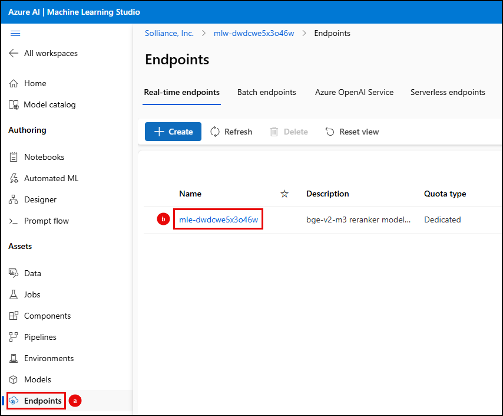

# 3.2 Configure the Azure AI extension

The `azure_ai` extension allows you to integrate the Azure OpenAI, Azure AI Language, and Azure ML services  directly into your database. Before using the `azure_ai` extension, you must configure the connections to each of your Azure AI and ML service resources by providing the service's endpoint and subscription key.

## Execute SQL in pgAdmin to configure the extension

1. Return to the open instance of pgAdmin on your local machine and ensure it is connected to your PostgreSQL database.

2. In the pgAdmin **Object Explorer**, expand databases under your server.

3. Right-click the **contracts** database and select **Query Tool** from the context menu.

!!! task "Select each tab below and execute SQL statements provided to connect to each Azure AI service."

=== "Azure OpenAI"

    The Azure AI extension includes the `azure_openai` schema, which provides the ability to integrate the creation of vector representations of text values directly into your database by invoking [Azure OpenAI embeddings](https://learn.microsoft.com/azure/ai-services/openai/reference#embeddings). The vector ebmeddings can then be used in vector similarity searches.

    1. In the new pgAdmin query window, paste the following SQL commands to configure the extension's connection to Azure OpenAI. Do not run the commands yet, as you first need to retrieve the endpoint and API key for your Azure OpenAI resource.

        ```sql
        SELECT azure_ai.set_setting('azure_openai.endpoint', 'https://<endpoint>.openai.azure.com');
        SELECT azure_ai.set_setting('azure_openai.subscription_key', '<API Key>');
        ```

    2. In a browser window, navigate to your Azure OpenAI service in the [Azure portal](https://portal.azure.com/).

    3. On the Azure OpenAI service page:

          1. Select the **Keys and Endpoint** menu item under **Resource Management**.

          2. Copy the **Endpoint** value, paste it as the `<endpoint>` value in the query to set the `azure_openai.endpoint` value in your pgAdmin query window.

          3. Copy the **KEY 1** value, paste it as the `<API Key>` value in the query to set the `azure_openai.subscription_key` value in your pgAdmin query window.

           

    4. In pgAdmin, execute the SQL commands by select the **Execute script** button.

        

    5. The `azure_ai` extension also provides the `get_setting` function to allow users with appropriate permissions to view the values stored in the `endpoint` and `subscription_key` settings within each schema. Run the following queries to view the Azure OpenAI endpoint and key values stored in the database.

        ```sql
        select azure_ai.get_setting('azure_openai.endpoint');
        ```
    
        ```sql title=""
        select azure_ai.get_setting('azure_openai.subscription_key');
        ```

=== "Azure AI Language"

    The Azure AI services integrations included in the `azure_cognitive` schema of the `azure_ai` extension provide a rich set of AI Language features accessible directly from the database.
    
    1. In the pgAdmin query window, overwrite the previous commands by pasting the following SQL commands to configure the extension's connection to the Azure AI Language service. Do not run the commands yet, as you first need to retrieve the endpoint and API key for your Language service.

        ```sql
        SELECT azure_ai.set_setting('azure_cognitive.endpoint', '{endpoint}');
        SELECT azure_ai.set_setting('azure_cognitive.subscription_key', '{api-key}');
        -- The region setting is required for the translate function
        SELECT azure_ai.set_setting('azure_cognitive.region', '<region>');
        ```

    2. In a browser window, navigate to your Language service in the [Azure portal](https://portal.azure.com/).

    3. On the Language service page:

          1. Select the **Keys and Endpoint** menu item under **Resource Management**.

          2. Copy the **Endpoint** value, paste it as the `<endpoint>` value in the query to set the `azure_cognitive.endpoint` value in your pgAdmin query window.

          3. Copy the **KEY 1** value, paste it as the `<API Key>` value in the query to set the `azure_cognitive.subscription_key` value in your pgAdmin query window.

          4. Copy the **Location/Region** value, paste it as the `<region>` value in the query to set the `azure_cognitive.region` value in your pgAdmin query window.
       
           
        
    4. In pgAdmin, execute the SQL commands by select the **Execute script** button.        

=== "Azure ML"

    The Azure AI extension gives the ability to invoke any machine learning models deployed on Azure Machine Learning (ML) online endpoints from within SQL. These models can be from the Azure ML catalog or custom models that are trained and deployed.

    1. In the pgAdmin query window, overwrite the previous commands by pasting the following SQL commands to configure the extension's connection to Azure ML. Do not run the commands yet, as you first need to retrieve the endpoint and key for the model deployed on Azure ML.

        ```sql
        SELECT azure_ai.set_setting('azure_ml.scoring_endpoint','<endpoint>');
        SELECT azure_ai.set_setting('azure_ml.endpoint_key', '<Key>');
        ```

    2. In a browser window, navigate to your Azure ML workspace in the [Azure portal](https://portal.azure.com/).

    3. From the Azure ML workspace page, select the **Launch studio** button to open Azure Machine Learning Studio in a new browser window.

        

    4. Sign into Machine Learning Studio, if prompted.

    4. In Machine Learning Studio, select **Endpoints** under **Assets** in the left-hand resource menu, then select the endpoint for your `bge-v2-m3-reranker model`:

        

    5. On your endpoint page: TODO: Get the steps below right and a screenshot.

       1. Select the **Consume** tab.
       2. Copy the **TODO: Endpoint** value, paste it as the `<endpoint>` value in the query to set the `azure_cognitive.endpoint` value in your pgAdmin query window.
       3. Copy the **TODO: KEY** value, paste it as the `<API Key>` value in the query to set the `azure_cognitive.subscription_key` value in your pgAdmin query window.
       
           
        
    9.  In pgAdmin, execute the SQL commands by select the **Execute script** button.
