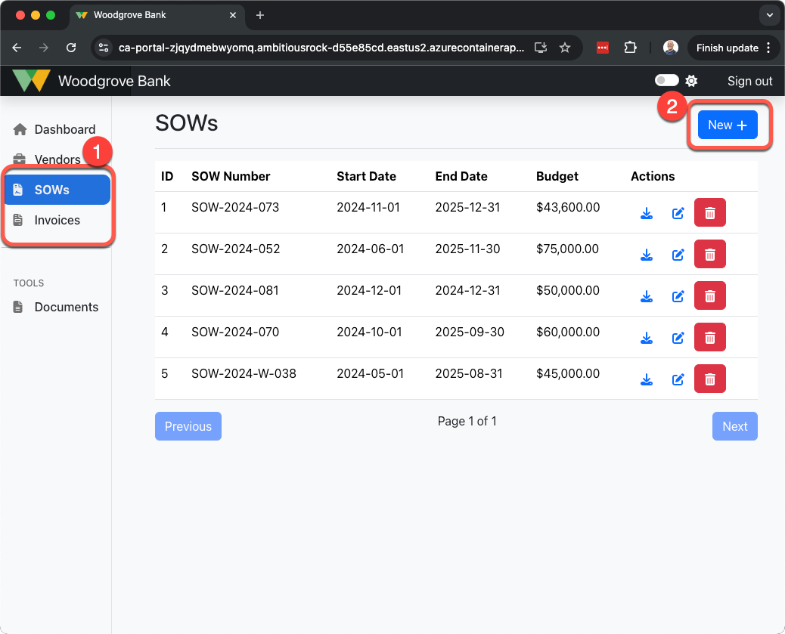
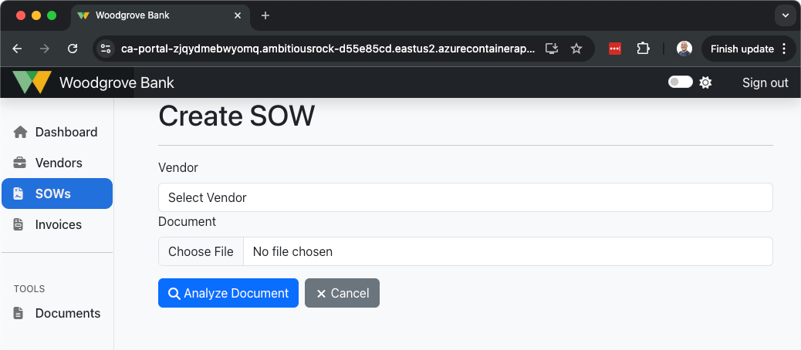
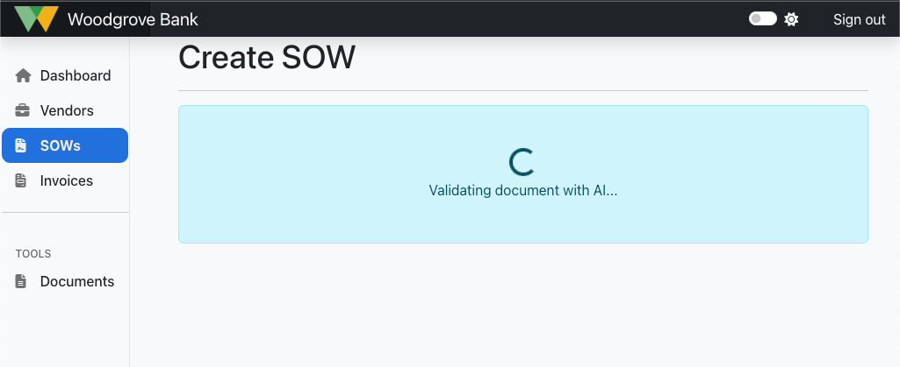

# 4.4 Validate Data with Azure OpenAI

The document ingestion pipeline within the application for SOW and Invoice records is implemented with a multi-stage workflow. The first stage of the workflow is analyzing the document and ingesting it into the system to INSERT/UPDATE SOW and Invoice records based on the document uploaded. The second stage of the workflow is to validate the SOW and/or Invoice record.

The SOW and Invoice validation step of the document ingestion workflow uses Azure OpenAI to perform a chat completion using retrieval augmented generation (RAG) pattern to validate the data from the database and generate an analysis of the validation result.

The code for the validation step of the workflow processes is contained within the REST API `/validation/invoice/{id}` endpoint for Invoices, and `/validation/sow/{id}` endpoint for SOWs. The code for these is located within the `src/api/app/routers/validation.py` file. The below explanation covers the process for validating Invoices, but the same strategy is followed for SOW too.

---

## Benefits of Using Azure OpenAI for Validation

The integration of Azure OpenAI into the validation workflow provides several key benefits:

- **Automated Validation:** Reduces the need for manual data reviews, saving time and effort.

- **Accuracy and Compliance:** Ensures invoices align with contractual agreements in SOWs, reducing payment errors.

- **Fraud Detection:** Help identifies potential invoice fraud or inconsistencies before payments are processed.

- **Scalability:** Can handle large volumes of invoices efficiently, making it suitable for enterprises with extensive vendor relationships.

- **Audit and Traceability:** Stores detailed validation results for future reference, supporting regulatory and compliance requirements.

---

## Invoice Validation Workflow

The validation workflow of Invoices and SOWs is implemented using the same retrieval augmented generation (RAG) pattern and system prompt style. Let's walk through the steps involved with the workflow process to validate Invoices:

### Step 1: Trigger Invoice Validation

The validation process begins when an invoice id is sent in a request to the validation API endpoint:

```text
POST / validation/invoice/{id}
```

The `{id}` placeholder is where the `id` of the Invoice will be passed in. The API handler (within the `src/api/app/routers/validation.py` file) will use this id to retrieve the relevant data from the database.

### Step 2: Define System Prompt

Before Azure OpenAI can be used to perform the validation, the system prompt must first be defined. This system prompt sill instruct the AI what it's expected to do, what to look for in the data, and how to respond with the validation results.

This application includes code that retrieves the system prompt from a text file:

```python linenums="40" title="src/api/app/routers/validation.py"
# Define the system prompt for the validator.
system_prompt = prompt_service.get_prompt("invoice_validation")
# Append the current date to the system prompt to provide context when checking timeliness of deliverables.
system_prompt += f"\n\nFor context, today is {datetime.now(timezone.utc).strftime('%A, %B %d, %Y')}."
```

For reference, here's the system prompt the application uses for validating Invoices:

```text linenums="1" title="src/api/app/prompts/invoice_validation.txt"
You are an intelligent copilot for Woodgrove Bank designed to automate the validation of vendor invoices against billing milestones in statements of work (SOWs).
   
When validating an invoice, you should:
1. Verify that the invoice number matches the vendor's records.
2. Check that the total amount on the invoice is correct.
3. Ensure that the milestone delivery dates are before or on the specified due date in the SOW.
4. Assess any late fees or penalties that may apply, as defined by the SOW. For example, if a milestone is late, a penalty of 15% should be applied to payment of that milestone.
5. Validate the line items on the invoice against the billing milestones in the SOW.
6. Ensure that the amount billed for each line item matches the billable amount specified in the SOW.
7. If the invoice contains notes to explain discrepancies, review them for additional context.
8. Confirm that the invoice is legitimate and ready for payment.

If there are milestones missing from the invoice that are not yet beyond their due date according to the SOW, do not flag them as discrepancies.
If the payment terms on the invoice are different from the SOW, assume the SOW is correct.

In your response:
- Provide a statement of valid or invalid for the invoice.
- Create separate sections for the invoice and the milestone validation.
- Provide a detailed summary of the validation results, including any discrepancies or anomalies found between the invoice and the SOW.
- If any discrepancies or anomalies are found, you should provide detailed feedback on the issues discovered, like including dollar amounts, line items, and due dates.
- If there are any discrepancies, flag the invoice for further review.

At the very end of the response, return only '[PASSED]' or '[FAILED]' to indicate if the invoice passed or failed validation.
```

The system prompt is also adding additional context of todays date. This is because the LLM doesn't know what the date is, and since Invoices and line items are date sensitive, the LLM needs to know the current date in order to more accurately perform date validations.

At the end of the system prompt is instruction for it to add the values of `[PASSED]` or `[FAILED]` at the end of the output to indicate whether it passed or failed validation. This will be used by the code to more easily determine a boolean of true/false to insert into the database later that indicates the pass or fail state.

### Step 3: Construct Full Prompt with RAG

The next step is to construct the full prompt for LangChain to use, in addition to specify the tools that will be used to implement a retrieval augmented generation (RAG) pattern.

With most of the instructions of how to perform the validation contained within the system prompt, the user prompt only needs to be simple in telling the AI what to do. In this application, the user prompt is just telling the AI to perform an invoice validation along with providing the context of the id of the invoice to validate.

```python linenums="72" title="src/api/app/routers/validation.py"
userMessage = f"""validate Invoice with ID of {id}"""
```

This user prompt is put together with the system prompt to construct the full prompt that will be sent to the AI.

```python linenums="68" title="src/api/app/routers/validation.py"
# Provide the validation copilot with a persona using the system prompt.
messages = [{ "role": "system", "content": system_prompt }]

# Add the current user message to the messages list
userMessage = f"""validate Invoice with ID of {id}"""
messages.append({"role": "user", "content": userMessage})

# Create a chat prompt template
prompt = ChatPromptTemplate.from_messages(
    [
        ("system", system_prompt),
        ("user", "{input}"),
        MessagesPlaceholder("agent_scratchpad")
    ]
)

# Define tools for the agent
tools = [
        StructuredTool.from_function(coroutine=validate_invoice)
]
```

This defines a LangChain tool for implementing the retrieval augmented generation pattern using the `validate_invoice` method that will be used to retrieve the relevant data from the database to validate the invoice.

You can expand the section below to see the specific section of code that performs the `azure_ai` call to generate the document summary, within the database INSERT and UPDATE statements.

???+ info "Retrieve context data from database"

    ```py linenums="112" title="src/api/app/routers/validation.py"
    async def validate_invoice(id: int):
        """Retrieves an Invoice and it's associated Line Items, SOW, and Milestones."""
    
        pool = await get_db_connection_pool()
        async with pool.acquire() as conn:
            row = await conn.fetchrow('SELECT * FROM invoices WHERE id = $1;', id)
            if row is None:
                raise HTTPException(status_code=404, detail=f'An invoice with an id of {id} was not found.')
            invoice = parse_obj_as(InvoiceModel, dict(row))
    
            # Get the vendor name
            vendor_row = await conn.fetchrow('SELECT * FROM vendors WHERE id = $1;', invoice.vendor_id)
            invoice.vendor = parse_obj_as(Vendor, dict(vendor_row))
    
            # Get the invoice line items
            line_item_rows = await conn.fetch('SELECT * FROM invoice_line_items WHERE invoice_id = $1;', id)
            invoice.line_items = [parse_obj_as(InvoiceLineItem, dict(row)) for row in line_item_rows]
    
    
    
            # Get the SOW
            sow_row = await conn.fetchrow('SELECT * FROM sows WHERE id = $1;', invoice.sow_id)
            sow = parse_obj_as(SowModel, dict(sow_row))
    
            # Get the milestones
            milestone_rows = await conn.fetch('SELECT * FROM milestones WHERE sow_id = $1;', invoice.sow_id)
            sow.milestones = [parse_obj_as(MilestoneModel, dict(row)) for row in milestone_rows]
    
            # Get the deliverables for each milestone
            for milestone in sow.milestones:
                deliverable_rows = await conn.fetch('SELECT * FROM deliverables WHERE milestone_id = $1;', milestone.id)
                milestone.deliverables = parse_obj_as(list[Deliverable], [dict(row) for row in deliverable_rows])
           
    
        return invoice, sow
    ```

### Step 4: Invoke the AI

With the prompt built and the RAG tools defined, the AI can now be invoked to perform the validation and generate the response.

```python linenums="93" title="src/api/app/routers/validation.py"
# Invoke the agent to perform a chat completion that provides the validation results.
completion = await agent_executor.ainvoke({"input": userMessage})
validationResult = completion['output']
```

### Step 5: Parse our passed or failed state

Now that the generative AI response is returned with the validation results, the `[PASSED]` or `[FAILED]` values the system prompt told the AI to add to the end of the response can be parsed out. This will be used to set a true / false in the database to more easily indicate if the validation passed or failed.

```python linenums="97" title="src/api/app/routers/validation.py"
# Check if validationResult contains [PASSED] or [FAILED]
# This is based on the prompt telling the AI to return either [PASSED] or [FAILED]
# at the end of the response to indicate if the invoice passed or failed validation.
validation_passed = validationResult.find('[PASSED]') != -1
```

### Step 6: Insert Validation Result into database

With the validation response generated and a passed or failed result, the validation results can now be inserted into the database, and the response returned from the REST API.

```python linenums="102" title="src/api/app/routers/validation.py"
# Write validation result to database
pool = await get_db_connection_pool()
async with pool.acquire() as conn:
    await conn.execute('''
    INSERT INTO invoice_validation_results (invoice_id, datestamp, result, validation_passed)
    VALUES ($1, $2, $3, $4);
    ''', id, datetime.utcnow(), validationResult, validation_passed)

return validationResult
```

This completes the Validation step of the workflow process.

---

## SOW Validation Workflow

The validation workflow for SOWs is built using the same retrieval augmented generation (RAG) pattern, with a system prompt that is written specifically for the unique validation requirements of SOWs.

The system prompt for validating SOWs is located within the `src/api/app/prompts/sow_validation.txt` file. In the next section, we'll review the structure and formatting of the SOW and Invoice validation system prompts.

The user prompt for the SOW validation tells the AI to validate a SOW and gives it the id of the SOW to validate.

```python linenums="124" title="src/api/app/routers/validation.py"
userMessage = f"""validate SOW with ID {id}"""
```

The RAG part of the SOW validation is setup with a LangChain tool using the `validate_sow` method within the `src/api/app/routers/validation.py` file.

```python linenums="136" title="src/api/app/routers/validation.py"
tools = [
    StructuredTool.from_function(coroutine=validate_sow)
]
```

This method is used to retrieve the SOW data (sow, milestones, and deliverables) from the database for the context needed to perform the validation.

```python linenums="161" title="src/api/app/routers/validation.py"
async def validate_sow(id: int):
    """Retrieves a SOW and it's associated Milestones and Deliverables."""

    pool = await get_db_connection_pool()
    async with pool.acquire() as conn:
        row = await conn.fetchrow('SELECT * FROM sows WHERE id = $1;', id)
        if row is None:
            raise HTTPException(status_code=404, detail=f'A SOW with an id of {id} was not found.')
        sow = parse_obj_as(SowModel, dict(row))

        # Get the milestones
        milestone_rows = await conn.fetch('SELECT * FROM milestones WHERE sow_id = $1;', id)
        sow.milestones = [parse_obj_as(MilestoneModel, dict(row)) for row in milestone_rows]

        # Get the deliverables for each milestone
        for milestone in sow.milestones:
            deliverable_rows = await conn.fetch('SELECT * FROM deliverables WHERE milestone_id = $1;', milestone.id)
            milestone.deliverables = parse_obj_as(list[Deliverable], [dict(row) for row in deliverable_rows])

    return sow
```

---

## Perform Document Validation

Accessing the UserPortal application in your deployment of the application for this workshop will allow you to upload documents and perform validations for SOWs and Invoices.

Follow these steps to upload a document and exercise the document ingestion workflow process:

1. Open the browser and navigate to the deployed UserPortal application.
1. Within the left-side navigation of the application, click on either "**SOWs**" or "**Invoices**"" for the document type you want to upload, analyze and validate.
1. On the page that lists the **SOWs** or **Invoices**, click the **New** button in the upper-right.

     

1. On the **New** page, select the **Vendor** and select the document (`.pdf` file) to upload, then click **Analyze Document**.

    

1. The Document workflow will initiate with the **Analyze** step, and the UI will display a message showing that it's running.

    

1. Once **Analyzing** is completed, then **Validating** will be run, and you will see the UI indicate this.

    

1. Once the **Validating** is completed, the application will display the validation results with the pass or fail indicated. These results are the full response from the AI when performing the validation.

    

1. Dismissing this dialog (clicking **Close**) will enable you to see the full details of the record.

1. On both the SOW and Invoice edit pages, you can scroll down to the bottom to view the history of validations that have been performed on the record. You will also find a **Run Manual Validation** button that is setup to enable re-running of just the validation step of the workflow.

    

1. These steps can be repeated for uploading, analyzing and validating both SOWs and Invoices within the application.

---

## References

[LangChain with Azure OpenAI and ChatPGT using Python](https://learn.microsoft.com/samples/azure-samples/function-python-ai-langchain/function-python-ai-langchain/)
