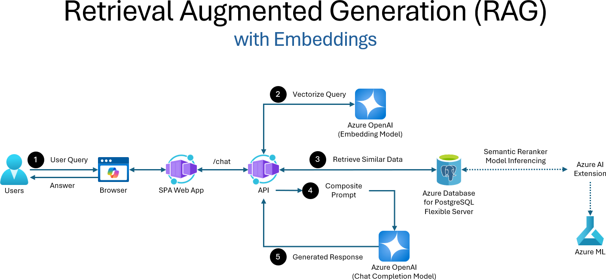

# Implement a Copilot

In this task, you will add an AI-copilot to the _Woodgrove Bank Contract Management_ application using Python and the GenAI capabilities of Azure Database for PostgreSQL - Flexible Server and the Azure AI extension. Using the AI-validated data, the copilot will use RAG to provide insights, and answer questions, about vendor contract performance and invoicing accuracy, serving as an intelligent assistant for Woodgrove Banks users.

## What are copilots?

Copilots are advanced AI assistants designed to augment human capabilities and improve productivity by providing intelligent, context-aware support, automating repetitive tasks, and enhancing decision-making processes. For instance, an AI copilot can assist in code review and suggest improvements in software development. In customer service, it can handle routine queries, freeing up human agents for more complex issues. In data analysis, it can identify patterns and trends in large datasets. AI copilots can be employed in diverse fields such as these, and many more.

## Why use Python?

Python's simplicity and readability make it a popular programming language for AI and machine learning projects. Its extensive libraries and frameworks, such as LangChain, FastAPI, and many others, provide robust tools for developing sophisticated copilots. Python's versatility allows developers to iterate and experiment quickly, making it a top choice for building AI applications.

## The RAG Pattern

The solution leverages the _Retrieval Augmented Generation_ (RAG) design pattern to ensure the copilot's responses are grounded in the (private) data maintained by Woodgrove Bank.

To understand how the RAG design pattern works in the context of the _Woodgrove Bank Contract Management_ application, select the tabs in order to review the sequence of events shown in the figure above.

TODO: Update the content of the tabs below -- Include details about function calling to access information in databases and other "private" sources.

=== "1. Get Query"

    !!! info "The user query arrives at our copilot implementation via the endpoint (API)"
    
    User queries entered into the portal UI and passed into the Woodgrove Bank API's `/chat` endpoint. The incoming "user query" has two components: the user _question_ (text input) and an optional _chat history_ (object array).
    
    The API extracts these parameters from the incoming request, and invokes the `/chat` endpoint - starting the workflow reflecting this RAG design pattern.

=== "2. Vectorize Query"

    !!! info "The copilot sends the text query to Azure OpenAI to generate vector embeddings."
    
    The `/chat` endpoint calls out to Azure OpenAI, where the user's text input is vectorized using a Large Language "Embedding" Model (e.g., Azure Open AI `text-embedding-3-large`). This vector is then sent into the PostgreSQL database to retrieve similar records in the next step.

=== "3. Retrieve Similar Data"

    !!! info "A hybrid search query is executed against the database to return semantically similar results."

    ### RAG Pattern
    
    In this step, the vectorized query from the previous step is compared to data in relevant database tables to find and return _matching results_ based on vector similarity. The database can also use features like _semantic ranking_ to order the returned results and _GraphRAG_ to identify relationship between data to improve the accuracy of the RAG design pattern.

    ### Semantic Ranking
    TODO: Add details about semantic ranking and graph rag...

    TODO: Include details about SEMANTIC RANKER MODEL () and include in the text above
    - Update data and flow diagrams to talk about semantic ranker for custom model inference.
    - Blog post to use are reference: <https://techcommunity.microsoft.com/blog/adforpostgresql/introducing-the-semantic-ranking-solution-for-azure-database-for-postgresql/4298781>
    - Model to use: <https://huggingface.co/BAAI/bge-reranker-v2-m3>

    ### GraphRAG

    TODO

=== "4. **Augment** Query"

    !!! info "The copilot augments user prompt with retrieved knowledge in request to model"
    
    The Contoso Chat application combines the user's original _question_ with returned "documents" from the information retrieval service, to create an enhanced _model prompt_. This is made easier using prompt template technologies (e.g., Prompty) with placeholders - for chat history, retrieved documents, and customer profile information - that are filled in at this step.

=== "5. **Generate** Response"

    !!! info "The chat model uses prompt to generate a grounded response to user question."
    
    This enhanced prompt is now sent to the Large Language "chat" model (e.g., Azure OpenAI `gpt-35-turbo` or `gpt-4o`) which sees the enhanced prompt (retrieved documents, customer profile data, chat history) as _grounding_ context for generating the final response, improving the quality (e.g., relevance, groundedness) of results returned from Contoso Chat.
