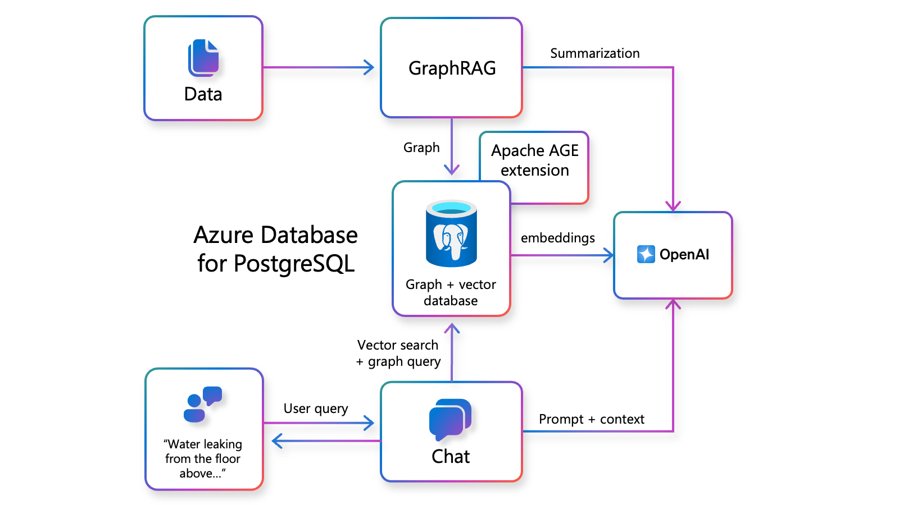

# 6.4 Review GraphRAG

**GraphRAG** (Graph Retrieval-Augmented Generation) is an innovative technique developed by Microsoft Research. It significantly enhances the accuracy and relevance of responses generated by Retrieval-Augmented Generation (RAG) systems. _Graph_ refers to a data structure that represents entities and their relationships. This structure is often visualized as nodes (vertices) and edges, where nodes represent entities and edges represent the relationships or connections between these entities.

The GraphRAG technique involves three main steps:

1. **Graph Extraction**: Creating a knowledge graph from the source data.
2. **Entity Summarization**: Summarizing entities within the graph to capture essential information.
3. **Graph Query Generation**: Generating graph queries at query time to retrieve relevant information based on the prominence and relationships within the graph.

In the context of Azure Database for PostgreSQL, GraphRAG leverages the structure of knowledge graphs extracted from source data to provide better context and improve the quality of responses from language models. By integrating GraphRAG with PostgreSQL, you can enhance the information retrieval pipeline, making it more accurate and context-aware. This is particularly useful for applications where the accuracy and relevance of information are critical.

## GraphRAG with Apache AGE

[Apache Graph Extension](https://age.apache.org/age-manual/master/index.html) (AGE) is a PostgreSQL extension developed under the Apache Incubator project. It offers a significant advancement that provides graph processing capabilities within the PostgreSQL ecosystem, enabling users to store and query graph data efficiently. This new extension brings a powerful toolset for developers looking to leverage a graph database with the robust enterprise features of Azure Database for PostgreSQL.

With AGE, you can manage and analyze complex relationships within your data, uncovering insights that traditional relational databases and even semantic search might miss.

---

_Select the tabs below to discover the key features and benefits of using AGE in Azure Database for PostgreSQL._

=== "Key Features"

    - **Graph and Relational Data Integration**: AGE allows seamless integration of graph data with existing relational data in PostgreSQL. This hybrid approach lets you benefit from both graph and relational models simultaneously.
    - **openCypher Query Language**: AGE incorporates openCypher, a powerful and user-friendly query language specifically designed for graph databases. This feature simplifies the process of writing and executing graph queries.
    - **High Performance**: AGE is optimized for performance, ensuring efficient storage and retrieval of graph data thanks to support for indexing graph properties using GIN indices.
    - **Scalability**: Built on PostgreSQL's proven architecture, AGE inherits its scalability and reliability, allowing it to handle growing datasets and increasing workloads.

=== "Benefits"

    The integration of AGE in Azure Database for PostgreSQL brings numerous practical benefits to developers and businesses looking to leverage graph processing capabilities:
    
    - **Simplified Data Management**: AGE's ability to integrate graph and relational data simplifies data management tasks, reducing the need for separate graph database solutions.
    - **Enhanced Data Analysis**: With AGE, you can perform complex graph analyses directly within your PostgreSQL database, gaining deeper insights into relationships and patterns in your data.
    - **Cost Efficiency**: By utilizing AGE within Azure Database for PostgreSQL, you can consolidate your database infrastructure, lowering overall costs and reducing the complexity of your data architecture.
    - **Security and Compliance**: AGE leverages Azure's industry-leading security and compliance features to ensure your graph data is protected and meets regulatory requirements, providing you with peace of mind.
