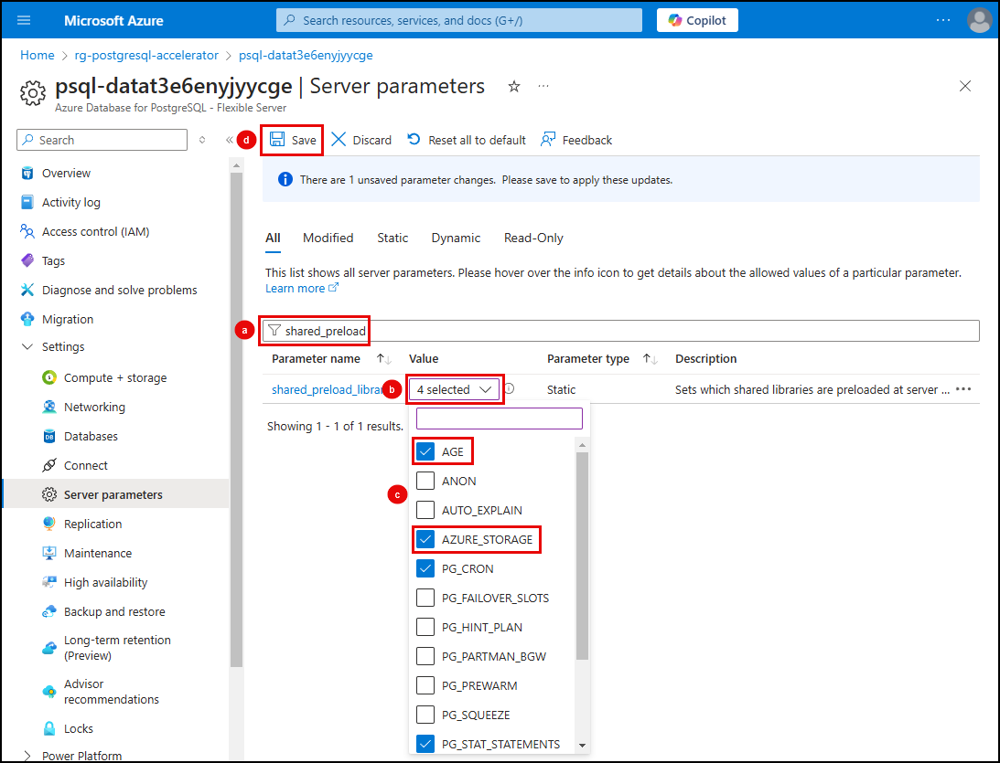

# 6.5 Enable AGE

The **Apache AGE** (`age`) extension enhances PostgreSQL by allowing it to be used as a graph database, providing a comprehensive solution for analyzing interconnected data. With `age`, you can define and query complex data relationships using graph structures.

To simplify the extraction of data from your PostgreSQL database into CSV files hosted in Azure Blob Storage, you will also use the [Azure Storage extension](https://learn.microsoft.com/azure/postgresql/flexible-server/how-to-use-pg-azure-storage) (`azure_storage`). This extension allows you to connect directly to an Azure Storage account from your PostgreSQL database, copy data out of the database, and write it into files in blob storage. From your storage account, the CSV files will be used as the data source for your graph database.

## Allowlist the extensions

Before using `age` and `azure_storage` extensions, add them to the PostgreSQL server's _allowlist_, configure them as shared preloaded libraries, and install them in your database.

_Select the tab for the method you want to use for allowlisting the extensions and follow the instructions provided._

=== "Azure CLI"

    1. Open a new integrated terminal window in VS Code and execute the following Azure CLI command at the prompt.

        !!! note "Ensure you replace the tokens in the command below with the appropriate values from your Azure environment."
    
            - **[YOUR_RESOURCE_GROUP]**: The name of the resource group hosting your Azure Database for PostgreSQL flexible server.
            - **[YOUR_POSTGRESQL_SERVER]**: The name of your Azure Database for PostgreSQL server.
            - **[YOUR_SUBSCRIPTION_ID]**: Your Azure subscription ID.
        
        ```bash
        az postgres flexible-server parameter set --resource-group [YOUR_RESOURCE_GROUP] --server-name [YOUR_POSTGRESQL_SERVER] --subscription [YOUR_SUBSCRIPTION_ID] --name azure.extensions --value azure_ai,pg_diskann,vector,age,azure_storage
        ```

=== "Azure portal"

    1. Navigate to your Azure Database for PostgreSQL flexible server instance in the [Azure portal](https://portal.azure.com/).

    2. From the left-hand resource menu:
        1. Expand the **Settings** section and select **Server parameters**.
        2. Enter "azure.extensions" into the search filter.
        3. Expand the **VALUE** dropdown list.
        4. Select the **AGE** and **AZURE_STORAGE** extensions by checking the box for each in the **VALUE** dropdown list.

        

## Load extensions on server start

Some Postgres libraries need to perform certain operations that can only take place at postmaster start, such as allocating shared memory, reserving lightweight locks, or starting background workers. `AGE` relies on shared memory for its operations, so it must be loaded at server start. The `shared_preload_libraries` parameter in PostgreSQL is used to specify libraries that should be loaded at server startup, enabling additional functionalities or extensions before any connections are made.

_Select the tab for the method you want to use to update the `shared_preload_libraries` parameter and follow the instructions provided._

=== "Azure CLI"

    1. In the VS Code integrated terminal window, execute the following Azure CLI command at the prompt.

        !!! note "Ensure you replace the tokens in the command below with the appropriate values from your Azure environment."
    
            - **[YOUR_RESOURCE_GROUP]**: The name of the resource group hosting your Azure Database for PostgreSQL flexible server.
            - **[YOUR_POSTGRESQL_SERVER]**: The name of your Azure Database for PostgreSQL server.
            - **[YOUR_SUBSCRIPTION_ID]**: Your Azure subscription ID.
        
        ```bash
        az postgres flexible-server parameter set --resource-group [YOUR_RESOURCE_GROUP] --server-name [YOUR_POSTGRESQL_SERVER] --subscription [YOUR_SUBSCRIPTION_ID] --name shared_preload_libraries --value age,azure_storage,pg_cron,pg_stat_statements
        ```
    
        !!! info "`pg_cron` and `pg_stat_statements` are set by default, so they are included in the above command to avoid removing them from the `shared_preload_libraries` parameter."

    2. The above command sets the parameter, but your PostgreSQL flexible server requires a restart for the setting to take effect. Run the following command to restart your server:

        !!! note "Ensure you replace the tokens in the command below with the appropriate values from your Azure environment."
    
            - **[YOUR_RESOURCE_GROUP]**: The name of the resource group hosting your Azure Database for PostgreSQL flexible server.
            - **[YOUR_POSTGRESQL_SERVER]**: The name of your Azure Database for PostgreSQL server.
            - **[YOUR_SUBSCRIPTION_ID]**: Your Azure subscription ID.

        ```bash
        az postgres flexible-server restart --resource-group [YOUR_RESOURCE_GROUP] --name [YOUR_POSTGRESQL_SERVER] --subscription [YOUR_SUBSCRIPTION_ID]
        ```

=== "Azure portal"

    1. On the **Server parameters** page of your Azure Database for PostgreSQL flexible server instance in the [Azure portal](https://portal.azure.com/):

        1. Enter "shared_preload" into the search filter.
        2. Expand the **VALUE** dropdown list.
        3. Select the **AGE** and **AZURE_STORAGE** extensions by checking the box for each in the **VALUE** dropdown list.
        4. Select **Save** on the toolbar.

        

    2. Select **Save** will trigger a restart of the PostgreSQL server and will take a few seconds to complete.

    3. In the _Save server parameter_ dialog that appears, select **Save and Restart**.

        

## Install extensions

With the `AGE` and `AZURE_STORAGE` extensions added to the _allowlist_ and loaded on your PostgreSQL server, you can install them in your database using the [CREATE EXTENSION](https://www.postgresql.org/docs/current/sql-createextension.html) command.

!!! warning "At this time, the AGE extension is in preview and will only be available for newly created Azure Database for PostgreSQL Flexible Server instances running at least PG13 up to PG16."

You will use **pgAdmin** to install the extension by executing a SQL command against your database.

1. On your local machine, return to the open instance of **pgAdmin** (or open it if you closed it after the setup tasks) and ensure it is connected to your PostgreSQL database.

2. In the pgAdmin **Object Explorer**, expand databases under your PostgreSQL server.

3. Right-click the **contracts** database and select **Query Tool** from the context menu.

4. Install the `age` and `azure_storage` extensions by running the following `CREATE EXTENSION` commands in the pgAdmin query window:

    ```sql title=""
    CREATE EXTENSION IF NOT EXISTS age;
    CREATE EXTENSION IF NOT EXISTS azure_storage;
    ```
