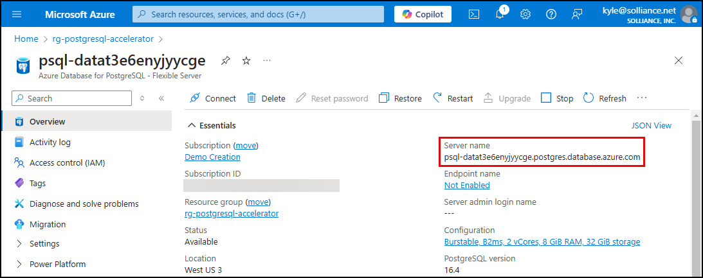
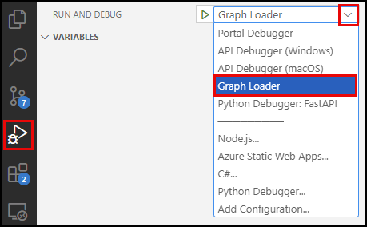

# 6.7 Create Graph Database

Hosting graph databases in Azure Database for PostgreSQL using the Apache AGE extension offers a powerful way to analyze relationships within your data. AGE combines graph and relational data seamlessly, leveraging the openCypher query language for efficient graph processing. This integration brings PostgreSQL's scalability, performance, and security to the table while enabling advanced data analysis and management. When incorporated into a copilot, this setup empowers you to evaluate vendor performance of SOW deliverables through invoice validation, ensuring your data-driven decisions are robust and insightful.

## Create Graph Database with AGEFreighter

[AGEFreighter](https://github.com/rioriost/agefreighter/) is a Python library designed to simplify the process of creating and loading graph databases in Azure Database for PostgreSQL, allowing data to be ingested from various sources, including file formats (CSV, AVRO, and Parquet), Azure Storage, Azure Cosmos DB, and Azure Database for PostgreSQL.

## Review code

The solution accelerator includes the `graph_loader.py` file in the `src/api/app` folder, which allows you to quickly run a Python script to create a graph database and populate it with data from CSV files.

The graph loader is implemented in the `src/api/app/graph_loader.py` file. Open it now in Visual Studio Code and explore the code in sections. You can also expand the section below to see the code inline and review explanations for the code.

???+ info "Graph Loader code"

    ```python linenums="1" title="src/api/app/graph_loader.py"
    import os
    from agefreighter import Factory
    from dotenv import load_dotenv
    from azure.identity import DefaultAzureCredential
    from azure.storage.blob.aio import BlobServiceClient
    
    async def main():
        """Load data into Azure Database for PostgreSQL Graph Database."""
        # Load environment variables from the .env file
        load_dotenv()
        print("Loading environment variables...")
    
        # Get environment variables
        server = os.getenv("POSTGRESQL_SERVER_NAME")
        database = 'contracts'
        username = os.getenv("ENTRA_ID_USERNAME")
        account_name = os.getenv("STORAGE_ACCOUNT_NAME")
    
        # Create an AGEFreigher factory instance to load data from multiple CSV files.
        print("Creating AGEFreighter factory instance...")
        factory = Factory.create_instance('MultiCSVFreighter')
    
        # Connect to the PostgreSQL database.
        print("Connecting to the PostgreSQL database...")
        await factory.connect(
            dsn=get_connection_string(server, database, username),
            max_connections=64
        )
    
        local_data_dir = 'graph_data/'
    
        # Download CSV data files from Azure Blob Storage
        print("Downloading CSV files from Azure Blob Storage...")
        await download_csvs(account_name, local_data_dir)
    
        # Load data into the graph database
        print("Loading data into the graph database...")
        await factory.load(
            graph_name='vendor_graph',
            vertex_csv_paths = [
                f'{local_data_dir}vendors.csv',
                f'{local_data_dir}sows.csv'
            ],
            vertex_labels = ['vendor', 'sow'],
            edge_csv_paths = [f'{local_data_dir}has_invoices.csv'],
            edge_types = ["has_invoices"],
            use_copy=True,
            drop_graph=True,
            create_graph=True,
            progress=True
        )
    
        print("Graph data loaded successfully!")
    
    def get_connection_string(server_name: str, database_name: str, username: str):
        """Get the connection string for the PostgreSQL database."""
        
        # Get a token for the Azure Database for PostgreSQL server
        credential = DefaultAzureCredential()
        token = credential.get_token("https://ossrdbms-aad.database.windows.net")
        port = 5432
    
        conn_str = "host={} port={} dbname={} user={} password={}".format(
            server_name, port, database_name, username, token.token
        )
        return conn_str
    
    async def download_csvs(account_name:str, local_data_directory: str):
        """Download CSV files from Azure Blob Storage."""
    
        # Create connection to the blob storage account
        account_blob_endpoint = f"https://{account_name}.blob.core.windows.net/"
        # Connect to the blob service client using Entra ID authentication
        client = BlobServiceClient(account_url=account_blob_endpoint, credential=DefaultAzureCredential())
    
        # List the blobs in the graph container with a CSV extension
        async with client:
            async for blob in client.get_container_client('graph').list_blobs():
                if blob.name.endswith('.csv'):
                    # Download the CSV file to a local directory
                    await download_csv(client, blob.name, local_data_directory)
    
    async def download_csv(client: BlobServiceClient, blob_path: str, local_data_dir: str):
        """Download a CSV file from Azure Blob Storage."""
        # Get the blob
        blob_client = client.get_blob_client(container='graph', blob=blob_path)
    
        async with blob_client:
            # Download the CSV file
            if await blob_client.exists():
                # create a local directory if it does not exist
                if not os.path.exists(local_data_dir):
                    os.makedirs(local_data_dir)
    
                with open(f'{local_data_dir}{blob_path.split('/')[-1]}', 'wb') as file:
                    stream = await blob_client.download_blob()
                    result = await stream.readall()
                    # Save the CSV file to a local directory
                    file.write(result)
    
    if __name__ == "__main__":
        import asyncio
        import sys
    
        if sys.platform == "win32":
            asyncio.set_event_loop_policy(asyncio.WindowsSelectorEventLoopPolicy())
    
        asyncio.run(main())
    ```

1. **Import libraries** (lines 1-5): Required classes and functions are imported from various libraries.

2. **Define `main` function** (line 7): The `main` function is the entry point of the graph loader. This function serves as the orchestrator for executing the code within the file.

3. **Load environment variables** (lines 10-17): The `load_dotenv()` method from the `dotenv` Python library allows variables from the `.env` file within the API project to be loaded as environment variables in the project. Note the names of the variables here, as you will be adding those to your `.env` file in the next step.

4. **Create an AGEFreighter factory** (line 21): The entry point for the `agefreighter` package in the `factory` class. This method creates an instance of the library using the type specified. You are loading your graph using multiple CSV files, so the `MultiCSVFreighter` class type is indicated.

5. **Connect to PostgreSQL** (lines 25-28): The `connect` method of the `factory` opens a connection to your Azure Database for PostgreSQL flexible server.

      1. The `get_connection_string()` function uses values from your environment variables to define the connection string the `factory` will use to connect to your database.
      2. The `get_connection_string()` function is defined on lines 55-66.

6. **Download CSV files from blob storage** (line 34): The CSV files you created in the previous task are downloaded from blob storage and written into a local folder, where the graph loader can easily access them.

      1. The `download_csvs()` function is defined on lines 68-81. This function creates a `BlobServiceClient` instance, which is used to retrieve the blobs in your storage account's `graph` container.
      2. For each blob with the extension of `.csv`, the `download_csv` function defined on lines 83-99 is used to retrieve the blob's contents and write them into a local file.

7. **Create and load the graph database** (lines 38-51): The `load` method of the `factory` does the following:

      1. Creates a graph named `vendor_graph`.
      2. Defines vertex (node) data and labels and inserts the nodes into the graph.
      3. Specifies edges using labels and inserts them to establish the relationships between the nodes.

8. **Define the main guard** (lines 101-108): The main guard defines how the `graph_loader` is executed when called directly. This code block lets you run the script from a command line or VS Code debugging session.

## Update `.env` file

The `graph_loader.py` file references environment variables to retrieve information about your Azure Database for PostgreSQL flexible server instance, your Entra ID username, and the storage account from which to pull CSV files. Before executing the graph loader script, you must update your project's `.env` file with these values. The `.env` file can be found in the `src\api\app` folder of the repo.

1. In VS Code, navigate to the `src\api\app` folder in the **Explorer** panel.

2. Open the `.env` file and add the following lines:

    ```ini title=""
    ENTRA_ID_USERNAME="{YOUR_ENTRA_ID_USERNAME}"
    POSTGRESQL_SERVER_NAME="{YOUR_POSTGRESQL_SERVER_NAME}"
    STORAGE_ACCOUNT_NAME="{YOUR_STORAGE_ACCOUNT_NAME}"
    ```

    ???+ tip "Follow these steps to retrieve the necessary values"

        1. Replace the `{YOUR_ENTRA_ID_USERNAME}` token in the `ENTRA_ID_USERNAME` variable's value with your Microsoft Entra ID, which should be the email address of the account you are using for this solution accelerator.

        2. Replace the `{YOUR_POSTGRESQL_SERVER_NAME}` token with the name of your PostgreSQL server. To get your server name:

           1. Navigate to your Azure Database for PostgreSQL flexible server resource in the [Azure portal](https://portal.azure.com/).
        
           2. In the **Essentials** panel of the PostgreSQL flexible server's **Overview** page, copy the **Server name** value and paste it into your `.env` file as the `POSTGRESQL_SERVER_NAME` value.

            

        3. Replace the `{YOUR_STORAGE_ACCOUNT_NAME}` token with the name of your storage account. To retrieve your storage account name:

           1. In the Azure portal, navigate to the Storage account resource in your resource group.

           2. On the Storage account page, copy the storage account name and paste it into your `.env` file as the `STORAGE_ACCOUNT_NAME` value.

            

3. Save the `.env` file.

## Load the graph database

You will use a VS Code debugging session to locally execute the `graph_loader.py` script. Follow the steps below to start a _Graph Loader_ debug session in VS Code.

1. In Visual Studio Code **Run and Debug** panel, select the **Graph Loader** option from the debug configurations dropdown list.

    

2. Select the **Start Debugging** button (or press F5 on your keyboard).

    

3. Wait for the graph loader to finish running, indicated by the `Graph data loaded successfully!` message in the terminal output.

    

## Verify data load

You will execute openCypher queries using **pgAdmin** to verify the data load and explore relationships in your graph database.

1. Return to **pgAdmin** and ensure it is connected to your PostgreSQL database.

2. In the pgAdmin **Object Explorer**, expand databases under your PostgreSQL server.

3. Right-click the **contracts** database and select **Query Tool** from the context menu.

4. Before you can run cypher queries, you must set the `ag_catalog` schema in your path:

    ```sql
    SET search_path = ag_catalog, "$user", public;
    ```

5. Now, run the following cypher query to view vendors with open invoices, the details of those invoices, and verify your graph database was loaded correctly:

    ```sql
    -- View vendors and SOWs, along with invoice details from edge properties
    SELECT * FROM ag_catalog.cypher('vendor_graph', $$
    MATCH (v:vendor)-[rel:has_invoices]->(s:sow)
    RETURN v.id AS vendor_id, v.name AS vendor_name, s.id AS sow_id, s.number AS sow_number, rel.payment_status AS payment_status, rel.amount AS invoice_amount
    $$) as graph_query(vendor_id BIGINT, vendor_name TEXT, sow_id BIGINT, sow_number TEXT, payment_status TEXT, invoice_amount FLOAT);
    ```

!!! success "Congratulations! You have successfully loaded your graph database with data from PostgreSQL."
