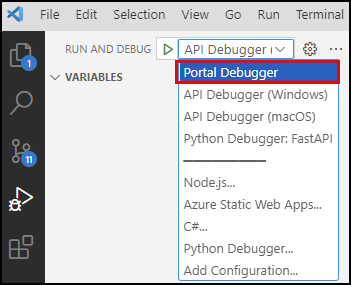

# 6.8 Update Copilot With GraphRAG

The next step is to update your API to use GraphRAG for data retrieval. You will update how your copilot finds and retrieves unpaid invoices for this.

## Review the function

Following the _function calling_ pattern used by your LangChain agent to retrieve data from the database, you will use a Python function to execute openCypher queries against your graph database from your copilot. Within the `src/api/app/functions/chat_functions.py` file, the `get_unpaid_invoices_for_vendor` function has been provided for executing cypher queries. Open it now in Visual Studio Code and explore the code with the function. You can also expand the section below to see the code inline.

???+ info "GraphRAG code"

    ```python linenums="1" title="src/api/app/functions/chat_functions.py"
    async def get_unpaid_invoices_for_vendor(self, vendor_id: int):
        """
        Retrieves a list of unpaid invoices for a specific vendor using a graph query.
        """
        # Define the graph query
        graph_query = f"""SELECT * FROM ag_catalog.cypher('vendor_graph', $$
        MATCH (v:vendor {{id: '{vendor_id}'}})-[rel:has_invoices]->(s:sow)
        WHERE rel.payment_status <> 'Paid'
        RETURN v.id AS vendor_id, v.name AS vendor_name, s.id AS sow_id, s.number AS sow_number, rel.id AS invoice_id, rel.number AS invoice_number, rel.payment_status AS payment_status
        $$) as (vendor_id BIGINT, vendor_name TEXT, sow_id BIGINT, sow_number TEXT, invoice_id BIGINT, invoice_number TEXT, payment_status TEXT);
        """
        rows = await self.__execute_graph_query(graph_query)
        return [dict(row) for row in rows]
    ```

1. **Define grapy query** (line 6): Creates the cypher query that will be used to look up unpaid invoices for the specified `vendor_id`

2. **Execute cypher query** (lines 12): The cyper query is sent to the database for execution, using the `__execute_graph_query()` function.

   1. The `__execute_graph_query()` function, starting on line 25 on the `chat_functions.py` file, runs the query against the `ag_catalog` schema, which contains the graph database. To enable this, it also includes a `SET` query prior to running the graph query to add `ag_catalog` to the `search_path` in the connection.

3. **Return the results** (lines 13): The query results are extracted and returned to the LLM.

## Implement GraphRAG

To implement GraphRAG functionality in your copilot, you must include the `get_unpaid_invoices_for_vendor` function in your LangChain agent's `tools` collection. You will add this function to the list of available tools to your agent.

1. In the VS Code **Explorer**, navigate to the `src/api/app/routers` folder and open the `completions.py` file.

2. Within the `tools` array, locate the following line (line 75):

    ```python
    StructuredTool.from_function(coroutine=cf.get_invoices),
    ```

3. Insert the following code on the line just below that:

    ```python
    StructuredTool.from_function(coroutine=cf.get_unpaid_invoices_for_vendor),
    ```

4. Your new `tools` array should look like this:

    ```python hl_lines="14"
    # Define tools for the agent to retrieve data from the database
    tools = [
        # Hybrid search functions
        StructuredTool.from_function(coroutine=cf.find_invoice_line_items),
        StructuredTool.from_function(coroutine=cf.find_invoice_validation_results),
        StructuredTool.from_function(coroutine=cf.find_milestone_deliverables),
        StructuredTool.from_function(coroutine=cf.find_sow_chunks_with_semantic_ranking),
        StructuredTool.from_function(coroutine=cf.find_sow_validation_results),
        # Get invoice data functions
        StructuredTool.from_function(coroutine=cf.get_invoice_id),
        StructuredTool.from_function(coroutine=cf.get_invoice_line_items),
        StructuredTool.from_function(coroutine=cf.get_invoice_validation_results),
        StructuredTool.from_function(coroutine=cf.get_invoices),
        StructuredTool.from_function(coroutine=cf.get_unpaid_invoices_for_vendor),
        # Get SOW data functions
        StructuredTool.from_function(coroutine=cf.get_sow_chunks),
        StructuredTool.from_function(coroutine=cf.get_sow_id),
        StructuredTool.from_function(coroutine=cf.get_sow_milestones),
        StructuredTool.from_function(coroutine=cf.get_milestone_deliverables),
        StructuredTool.from_function(coroutine=cf.get_sow_validation_results),
        StructuredTool.from_function(coroutine=cf.get_sows),
        # Get vendor data functions
        StructuredTool.from_function(coroutine=cf.get_vendors)
    ]
    ```

5. Save the `completions.py` file.

## Test with VS Code

As you have done previously, you will test your updates using Visual Studio Code.

### Start the API

Follow the steps below to start a debug session for the API in VS Code.

1. In Visual Studio Code **Run and Debug** panel, select the **API Debugger** option for your OS from the debug configurations dropdown list.

    

2. Select the **Start Debugging** button (or press F5 on your keyboard).

    

3. Wait for the API application to start completely, indicated by an `Application startup complete.` message in the terminal output.

    

### Start the Portal

With the API running, you can start a second debug session in VS Code for the Portal project.

1. Return to the **Run and Debug** panel in Visual Studio Code and select the **Portal Debugger** option from the debug configurations dropdown list.

    

2. Select the **Start Debugging** button (or press F5 on your keyboard).

    

3. This should launch the _Woodgrove Bank Contract Management Portal_ in a new browser window (<http://localhost:3000/>).

4. In the copilot chat on the **Dashboard** page, enter the following message and send it:

    ```ini title=""
    Tell me about the accuracy of unpaid invoices from Adatum.
    ```

5. Observe the results provided using GraphRAG.

    !!! tip "GraphRAG improves accuracy"

        Add a breakpoint in the `get_unpaid_invoices_for_vendor` function in the `chat_functions.py` file. The breakpoint will allow you to see the graph query executing and enable you to step through the remaining function calls to observe that the invoice validation results are only retrieved for the unpaid invoices. This precision reduces the data returned from the database and allows the RAG pattern to only receive the data it needs to generate a response.

!!! success "Congratulations! You just learned how to leverage the GraphRAG capabilities of Azure Database for PostgreSQL and AGE!"
